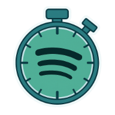
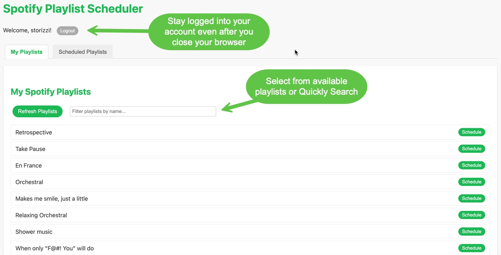
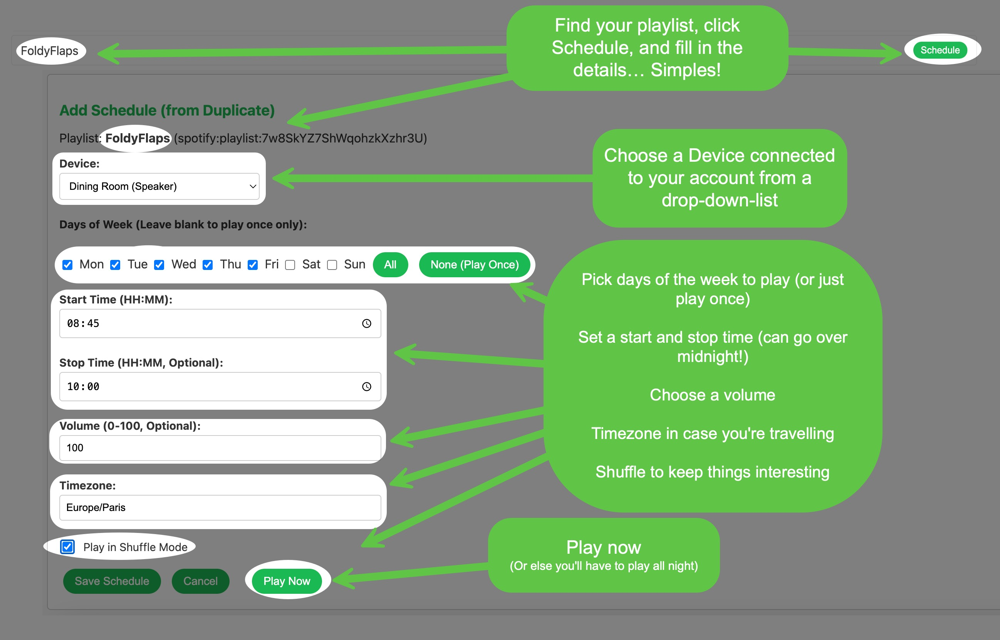
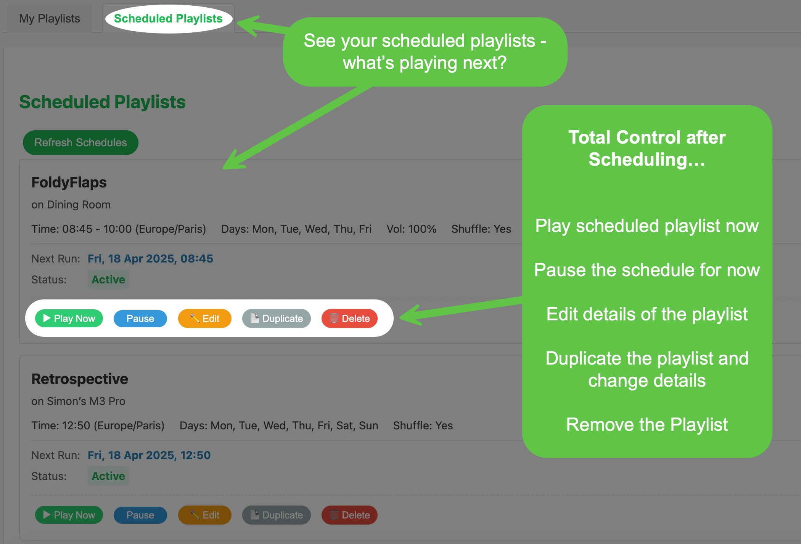

# PlaySched - Spotify Playlist Scheduler

[](https://opensource.org/licenses/MIT)



[Version History](VERSION.md) - Current Version: v0.1.0 - 18 Apr 2024

[Roadmap](ROADMAP.md)

A project combining a web application for scheduling Spotify playlist playback and a command-line tool for direct Spotify control and history management.

This will evolve over time. Currently, it is scratching an itch - I realised that the only reason I am using my Amazon Alexa™️ is for having music playing / stopping at certain times (and on certain days). The UI for doing this is atrocious. So now I get to unplug my Alexa, and use the much better speakers on my laptop using the Spotify App on there, driven by this scheduling app. See the [Roadmap](ROADMAP.md) for a roadmap of what may come in the future. Maybe. If I don't get distracted by other shiny things, now that this specific itch has been scratched.

## Overview

* **Web Application (`playsched.py`):** Provides a user-friendly web interface to schedule Spotify playlists to play on specific devices at set times. Includes options for recurrence (days of the week), start/stop times, volume, and shuffle mode. Allows managing created schedules (edit, duplicate, pause, delete).
* **Command-Line Script (`play_spotify_playlist.py`):** Offers direct terminal-based interaction with Spotify for listing devices/playlists, starting playback, and managing a local playback history database.

## Features

### Web Application (`playsched.py`) Features

* **Spotify Authentication:** Securely log in using your Spotify account (OAuth 2.0).
* **Playlist Browse:** View and filter your Spotify playlists.
* **Device Listing:** Automatically detects available Spotify Connect devices.
* **Scheduling:**
    * Select a playlist and target device.
    * Set a start time (HH:MM) and optional stop time (HH:MM).
    * Specify days of the week for recurring schedules (or leave blank for play-once).
    * Set playback volume (optional).
    * Enable/disable shuffle mode for playback.
    * Specify the schedule's timezone.
* **Schedule Management:**
    * View all created schedules, sorted by next run time.
    * Manually trigger playback ("Play Now").
    * Pause/Resume schedules (toggle active state).
    * Edit existing schedules.
    * Duplicate existing schedules to easily create variations.
    * Delete schedules.
* **Background Scheduler:** Uses APScheduler to automatically start/stop playback according to the defined schedules.

### Command-Line Script (`play_spotify_playlist.py`) Features

* **Device Listing:** Displays available Spotify Connect devices.
* **Playlist Listing:** Shows your playlists.
* **Playback Control:** Start playing a specified playlist on a selected device directly from the command line.
* **Playback History:**
    * Retrieves your recently played tracks from Spotify.
    * Stores this history in a local SQLite database (`spotify_history.db`).
    * Lists recently played playlists based on the stored history (with local time conversion).







## Prerequisites

* **Python:** Version 3.8 or higher recommended.
* **pip or conda:** For package installation.
* **OpenSSL:** Required for generating custom certificates (usually pre-installed on Linux/macOS, downloadable for Windows).
* **Spotify Account:** A regular or Premium Spotify account.
* **Spotify Developer App Credentials:** You need to register an application on the Spotify Developer Dashboard to get API keys. See detailed steps below.

### Setting up a Spotify Developer App

To allow this application to interact with your Spotify account, you need to register it on Spotify's developer platform:

1.  **Go to the Spotify Developer Dashboard:** Navigate to [developer.spotify.com/dashboard](http://developer.spotify.com/dashboard) in your web browser.
2.  **Log In:** Log in using your existing Spotify account credentials.
3.  **Create an App:** Click **"Create App"**, fill in the name and description, agree to terms, and click **"Create"**.
4.  **Get Credentials:** On the app dashboard, copy your **Client ID** and click **"Show client secret"** to copy your **Client Secret**. Keep the secret confidential.
5.  **Configure Redirect URI:** Click **"Edit Settings"**. Scroll to **"Redirect URIs"**. Add the exact URI(s) your application will use for callbacks. For this project using HTTPS on the default port `9093`, add **both** of these:
    ```
    [https://127.0.0.1:9093/callback](https://127.0.0.1:9093/callback)
    https://localhost:9093/callback
    ```
    *Using both `127.0.0.1` and `localhost` provides flexibility.* Ensure these **exactly match** the `SPOTIPY_REDIRECT_URI` you set in your `.env` file later. Add one URI per line.
    * Click **"Save"** at the bottom.
6.  **Use Credentials:** Copy the Client ID/Secret into your `.env` file.

## Installation

1.  **Clone the Repository:**
    ```bash
    git clone <your-repository-url>
    cd <repository-directory-name>
    ```

2.  **Set up a Virtual Environment (Recommended):**

    * **Using `venv` (standard Python):**
        ```bash
        # Create the environment (run once)
        python -m venv venv

        # Activate the environment
        # On Windows (cmd/powershell):
        .\venv\Scripts\activate
        # On macOS/Linux (bash/zsh):
        source venv/bin/activate
        ```

    * **Using `conda`:**
        ```bash
        # Create the environment (run once)
        conda create -n spotify-scheduler python=3.9 # Or your preferred Python 3.x version

        # Activate the environment
        conda activate spotify-scheduler
        ```

3.  **Install Dependencies:**
    Make sure your virtual environment is activated.
    ```bash
    pip install -r requirements.txt
    ```
    *(This installs Flask, Spotipy, APScheduler, python-dotenv, pytz, and pyOpenSSL).*

## Configuration (`.env` File)

The application uses environment variables loaded from a `.env` file in the project root.

1.  Create a file named `.env` in the root directory of the project. There is a sample called .env-sample you can copy as a template.
2.  Add the following variables, replacing the placeholder values with your actual credentials and desired settings:

    ```dotenv
    # Spotify API Credentials (Required)
    SPOTIPY_CLIENT_ID='YOUR_SPOTIFY_CLIENT_ID'
    SPOTIPY_CLIENT_SECRET='YOUR_SPOTIFY_CLIENT_SECRET'
    # Use the HTTPS URI matching your setup and Spotify Dashboard exactly
    SPOTIPY_REDIRECT_URI='[https://127.0.0.1:9093/callback](https://127.0.0.1:9093/callback)'

    # Flask Web App Configuration (Required)
    SECRET_KEY='YOUR_STRONG_RANDOM_SECRET_KEY' # Generate using: python -c 'import secrets; print(secrets.token_hex(16))'
    FLASK_DEBUG=1 # 1 for development (auto-reload, debugger), 0 for production

    # Optional: Flask Server Host/Port
    # FLASK_RUN_HOST=0.0.0.0 # Default allows network access
    # FLASK_RUN_PORT=9093 # Default if not set in playsched.py

    # Shared Application Settings (Required)
    SCHEDULE_DB_FILE='playsched.db'
    SPOTIPY_CACHE_PATH='.spotify_token_cache.json' # For scheduler auth token
    SCHEDULER_INTERVAL_SECONDS=15
    SCHEDULER_TIMEZONE='UTC' # Or your preferred TZ database name

    # --- Optional: Custom SSL Certificate for HTTPS ---
    # If BOTH FLASK_CERT_FILE and FLASK_KEY_FILE are set AND the files exist,
    # they will be used for HTTPS (avoids browser warnings if CA is trusted).
    # Otherwise, Flask falls back to 'adhoc' mode (requires pyOpenSSL, causes browser warnings).
    # Paths relative to project root or absolute. Generated by generate_certs.sh below.
    # FLASK_CERT_FILE=localhost.crt
    # FLASK_KEY_FILE=localhost.key

    # Optional: Spotify Market Code (Used by CLI)
    # SPOTIPY_MARKET='FR'

    # Note: CLI tool uses 'spotify_history.db' by default
    ```

    **Important:** Add `.env` to your `.gitignore` file!

## HTTPS for Local Development (Handling Spotify Requirement)

Spotify requires `https://` for callback URIs. The Flask development server needs configuration to use HTTPS. You have two options:

**Option 1: Use Custom Certificates (Recommended for No Browser Warnings)**

This involves generating your own Certificate Authority (CA) and a server certificate signed by it, then telling your OS/browser to trust your CA.

1.  **Generate Certificates:**
    * Run the provided Zsh script (ensure OpenSSL is installed):
        ```bash
        chmod +x generate_certs.sh
        ./generate_certs.sh
        ```
    * This creates `myCA.pem` (your CA cert), `myCA.key` (CA private key), `localhost.crt` (server cert), and `localhost.key` (server key) plus a few others (crt/csr/srl) if you need them.

2.  **Trust Your CA Certificate (`myCA.pem`):** You *must* do this for the browser to accept your `localhost.crt` without warnings.
    * **Chrome:**
        * Go to Settings -> Privacy and security -> Security -> Manage device certificates.
        * Alternatively, navigate directly to: `chrome://settings/certificates` (or potentially `chrome://certificate-manager/localcerts/usercerts` as you found).
        * Go to the **"Authorities"** tab.
        * Click **"Import..."**.
        * Select the generated `myCA.pem` file.
        * Check the box **"Trust this certificate for identifying websites"**.
        * Click OK/Finish. Restart Chrome.
    * **macOS (Additional Step):**
        * Import `myCA.pem` via Keychain Access (File > Import Items... or double-click the file).
        * Find the imported certificate (e.g., "My Local Development CA") in the relevant keychain (usually 'login').
        * Double-click it, expand the ▶ **Trust** section.
        * Set "When using this certificate:" to **"Always Trust"**. Close and enter password if prompted. Restart your browser.
    * **Windows:** Search for "Manage computer certificates", run as administrator. Navigate to "Trusted Root Certification Authorities" > "Certificates". Right-click "Certificates" > All Tasks > Import... Follow the wizard to import `myCA.pem` into this store.

3.  **Configure Flask:** Add the following lines to your `.env` file (uncomment them):
    ```dotenv
    FLASK_CERT_FILE=localhost.crt
    FLASK_KEY_FILE=localhost.key
    ```
    The `playsched.py` script will detect these files and use them for HTTPS.

4.  **Access:** Navigate to `https://localhost:9093` or `https://127.0.0.1:9093`. You should **not** see a security warning if the CA was trusted correctly.

**Option 2: Use Automatic 'adhoc' Certificates (Default Fallback)**

This is simpler but requires bypassing browser warnings every time.

1.  **Ensure `pyOpenSSL` is installed:** `pip install pyOpenSSL` (included in `requirements.txt`).
2.  **Do Not Set Cert/Key in `.env`:** Make sure `FLASK_CERT_FILE` and `FLASK_KEY_FILE` are *not* set or are commented out in your `.env` file.
3.  **Run Flask:** Start the app as usual (`flask run ...`). The console output will indicate it's using `'adhoc'` SSL.
4.  **Access & Bypass Warning:** Navigate to `https://localhost:9093` or `https://127.0.0.1:9093`. Your browser **will** show a security warning ("Your connection is not private", etc.). Click "Advanced" or similar, and choose to "Proceed to..." the site.

**Regardless of the method, ensure your `SPOTIPY_REDIRECT_URI` uses `https://` and matches the hostname you use to access the app (e.g., `https://127.0.0.1:9093/callback`).**

## Running the Application

### Running the Web Application

1.  **Activate your virtual environment**.
2.  **Set Flask App Environment Variable (if needed):**
    ```bash
    # On macOS/Linux (Corrected Filename)
    export FLASK_APP=playsched.py
    # On Windows (cmd) (Corrected Filename)
    set FLASK_APP=playsched.py
    # On Windows (PowerShell) (Corrected Filename)
    $env:FLASK_APP = "playsched.py"
    ```
3.  **Run the Flask Development Server:**
    ```bash
    flask run --host=0.0.0.0 --port=9093
    ```
4.  Open your web browser and navigate to `https://127.0.0.1:9093` (or `https://localhost:9093` if using that in your cert/config). Bypass security warnings if using the `adhoc` method.

### Running the Command-Line Script

1.  **Activate your virtual environment**.
2.  Run the script from your terminal within the project directory:
    ```bash
    python play_spotify_playlist.py --help
    ```
    This will show you the available command-line arguments.

## Usage

### Web Application Usage

1.  **Login:** Navigate to the web application URL and click "Login with Spotify". Authorize the app via the Spotify website.
2.  **Browse/Schedule:** Use the "My Playlists" tab to find playlists. Click "Schedule" to open the form.
3.  **Fill Form:** Select device, days, times, volume, shuffle, and timezone. Click "Save Schedule".
4.  **Manage:** Use the "Scheduled Playlists" tab to view, play now, pause/resume, edit, duplicate, or delete schedules. Schedules are sorted by the next calculated run time.

### Command-Line Script Usage

Use arguments to perform actions:

* List available devices:
    ```bash
    python play_spotify_playlist.py --list-devices
    ```
* List your playlists:
    ```bash
    python play_spotify_playlist.py --list-playlists
    ```
* Update local playback history database (`spotify_history.db`):
    ```bash
    python play_spotify_playlist.py --update-history
    ```
* Show recently played playlists from the local history database:
    ```bash
    python play_spotify_playlist.py --recent-playlists
    ```
* Play a playlist by name on a specific device:
    ```bash
    python play_spotify_playlist.py --device "My Speakers" --playlist "Chill Mix"
    ```
* Play a playlist using its Spotify URI:
    ```bash
    python play_spotify_playlist.py --device "My Speakers" --playlist "spotify:playlist:37i9dQ..."
    ```

*(See `python play_spotify_playlist.py --help` for all options)*

The play history is stored in the same database as the scheduler by default, but in case you have difficulty connecting to it at the same time as the shceduler is running, you can keep it in a different file using the `HISTORY_DB_FILE` environment variable in the .env file (e.g. `HISTORY_DB_FILE=spotify_history.db`). Future versions will integrate this functionality into the scheduler so that the history is updated periodically automatically, and for additional planned functionality.

## Notes & Caveats

* **Spotify API Rate Limits:** Heavy use might potentially hit Spotify API rate limits.
* **Device Availability:** Playback requires the target device to be online and active in Spotify. Actions will fail if the device is unavailable.
* **Scheduler Precision:** Scheduled jobs run based on the `SCHEDULER_INTERVAL_SECONDS`. Playback might start/stop slightly after the exact scheduled minute.
* **Timezones & DST:** Ensure correct timezone strings (TZ database names) are used in schedules. Backend calculations use `pytz` to handle timezones and DST.
* **Token Cache (`.spotify_token_cache.json`):** Stores the web app's authentication token, used by the scheduler. Deleting requires re-login via the web app.
* **Databases:** `schedule.db` stores web app schedules; `spotify_history.db` stores history for the CLI tool. Back them up if needed.

## Contributing

Contributions are welcome! Please feel free to submit a Pull Request or open an Issue. (Add more details here if you have specific guidelines).

## License

This project is licensed under the MIT License - see the [LICENSE](LICENSE) file for details.